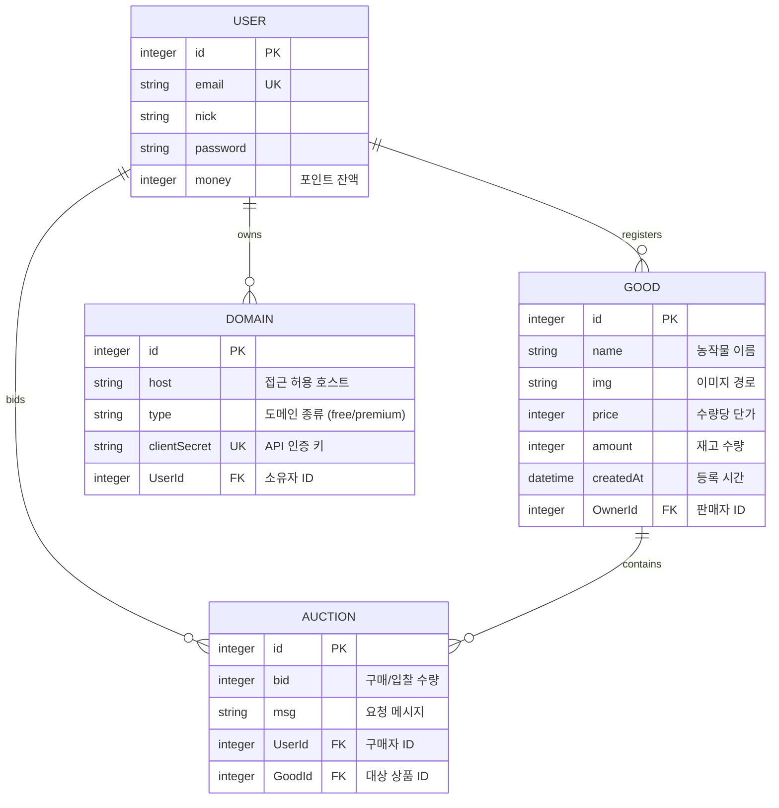
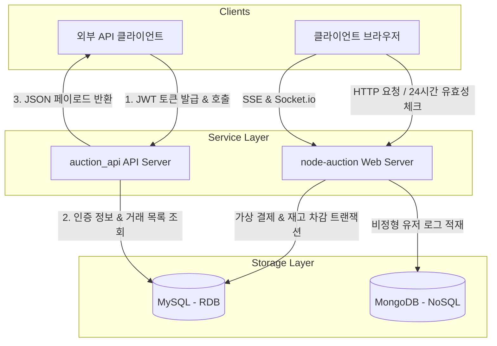

# 🥒 Jukini-Market

> **Project Date:** 2021.12.01 ~ 2021.12.15  
> **Collaborator:** @malangcongdduck  

당근마켓에서 영감을 받아 **농작물을 기른다면 누구나 쉽게 판매를 할 수 있는 웹사이트**를 구현했습니다. 마트보다 더 저렴하고, 안심하고 먹을 수 있는 농작물을 구매하는 플랫폼을 구축하는 것을 목적으로 했습니다. 

또한, **신선함 유지**라는 목적을 위해 **판매 등록 이후 24시간 이내의 상품만 구매**할 수 있도록 구현했으며 판매자는 판매내역을 확인, 구매자는 구매내역을 확인할 수 있도록 구현하였습니다. 그리고 홈쇼핑과 유사하게 **실시간으로 구매하는 내역을 누구나 볼 수 있도록** 하여 판매자가 쉽게 판매를 할 수 있도록 셀프 마켓팅을 위한 기능 또한 포함했습니다.

---

## 📖 프로젝트 개요

* **당근마켓에서 영감을 얻은 농작물 직거래 마켓**
  * 생산자가 남은 농작물을 저렴하고 안전하게 판매하고, 소비자는 신선한 농작물을 직거래로 합리적인 가격에 구매할 수 있는 환경 제공.
* **24시간 신선도 제한 시스템**
  * 등록 후 24시간이 초과된 상품은 자동으로 거래가 제한되도록 구현하여 농작물의 신선도와 신뢰성 확보.
* **실시간 구매 정보 공유 (셀프 마케팅)**
  * 실시간으로 발생하는 구매 내역을 SSE(Server-Sent Events) 및 Socket.io를 통해 모든 유저에게 즉각 공유하여 홈쇼핑과 같은 구매 심리 자극 및 판매 촉진 유도.
* **가상 포인트 시스템 도입**
  * 사업자 등록 한계로 실제 PG 결제 기능 도입은 보류되었으나, 가상 포인트 충전 및 차감 방식을 결제 프로세스에 준하여 구현.

---

## 📂 디렉터리 구조 (Directory Structure)

본 프로젝트는 실시간 거래 웹앱(`node-auction`)과 외부 데이터 제공용 서버(`auction_api`), 그리고 API 연동용 데모 앱(`auctioncat`)이 독립되어 관리되는 구조를 가지고 있습니다. 라우터에서 비즈니스 로직을 완벽히 분리하여 설계되었습니다.

```text
Jukini-Market/
├── node-auction/             # 실시간 경매 및 직거래 웹 어플리케이션
│   ├── app.js                # Express 설정, Nunjucks, Web Socket(Socket.io), SSE 연동
│   ├── controllers/          # 비즈니스 로직 컨트롤러 (index.js, auth.js)
│   ├── routes/               # 라우팅 및 미들웨어 (index.js, auth.js, middlewares.js)
│   ├── models/               # Sequelize 데이터베이스 모델 (user.js, good.js, auction.js)
│   ├── views/                # 프론트엔드 Nunjucks 화면 구성 파일
│   └── uploads/              # 업로드된 농작물 이미지 보관소
├── auction_api/              # 외부 전송용 OpenAPI 제공 서버
│   ├── app.js                # CORS 및 API Rate Limit 설정
│   ├── controllers/          # API 도메인 및 토큰/조회 로직 분리 (v1.js, v2.js, auth.js, index.js)
│   ├── routes/               # API v1/v2 라우팅
│   └── models/               # Domain 모델 및 User 연동 모델
└── auctioncat/               # API 클라이언트 연동 데모 웹앱
    ├── app.js                
    └── routes/               # JWT 토큰을 활용한 API 호출 클라이언트 비즈니스
```

---

## 📊 데이터 아키텍처 (Data Architecture)

Jukini-Market은 효율적이고 무결성 있는 직거래 서비스를 제공하기 위해 **관계형 데이터베이스(MySQL) 중심의 트랜잭션 관리**와 **비정형 데이터(MongoDB) 기반의 유연한 로그 수집 환경**을 병행하여 사용합니다.

### **1. 데이터베이스 스키마 관계도 (ERD)**

사용자(User), 상품(Good), 입찰/구매(Auction), 외부 연동 도메인(Domain) 테이블은 일대다(1:N) 관계로 Sequelize ORM을 통해 매핑 및 관리됩니다.



### **2. 데이터 흐름도 (Data Flow Diagram)**

사용자의 실시간 요청 처리 흐름과 외부 API 클라이언트의 토큰 검증 및 응답 아키텍처입니다.



---

## 🎯 사용한 기술

* **Frontend**
  * 화면 구성 및 사용자 인터페이스(UI) 구현을 위한 기술 적용
  * HTML/CSS, JavaScript (Nunjucks Template Engine)
* **Backend**
  * 데이터 처리 및 서버 API 구축을 위한 기술 적용
  * Node.js, Express, Flask
* **DB / Infra**
  * MySQL (Sequelize ORM), MongoDB
  * Passport (bcrypt 기반 인증), Socket.io & SSE (실시간 통신)

---

## 🙋‍♂️ 나의 역할

* **백엔드 개발**
  * Node.js / Express 기반의 서버 비즈니스 로직 구현 및 데이터 설계
  * bcrypt 암호화 알고리즘을 도입한 보안 로그인/회원가입 기능 개발
  * SSE 및 Socket.io 프로토콜을 활용한 실시간 구매/입찰 연동 엔진 구축
* **부하 테스트 및 API 기능 구현**
  * 외부 서비스 연동을 위한 JWT(Json Web Token) 발급 및 도메인 기반 CORS 관리 API 개발
  * Artillery 기반의 시나리오별 부하 테스트를 통한 서버 안정성 검증

---

## 🏆 주요 성과

* **사용자 중심 반응형 웹 인터페이스 구축**
  * 모바일 직거래 유저를 고려하여 다양한 디바이스 환경에서도 레이아웃이 깨지지 않도록 반응형 웹을 적용하여 사용자 접근성을 높임
* **NoSQL 기반의 유연한 데이터 파이프라인 설계**
  * MongoDB를 도입하여 형태가 다양하고 빠르게 확장되는 [사용자/서비스] 데이터를 스키마 제약 없이 유연하게 저장/관리하는 데이터베이스 환경을 구축
* **MVC 패턴 도입을 통한 가독성 및 유지보수성 향상**
  * Express 라우터에 복잡하게 얽혀 있던 DB 조회 및 비즈니스 로직을 `controllers` 디렉터리로 완전히 격리하여 모듈 간 결합도를 낮추고 소스코드 응집력을 높임
* **트랜잭션 안전성 확보**
  * 동시 다발적 입찰 상황에서도 소지금 차감과 재고 갱신이 안전하게 하나의 작업 단위(All-or-Nothing)로 처리되도록 Sequelize 트랜잭션을 적용하여 데이터 무결성 보장

---

## 💥 트러블 슈팅 (Trouble Shooting)

### 1️⃣ MongoDB 데이터 증가에 따른 조회 속도 저하 문제
* **현상:** 부하 테스트 과정에서 데이터베이스에 누적된 데이터가 많아질수록 특정 조건의 데이터를 불러와 화면에 띄우는 응답 속도가 점진적으로 저하되었습니다.
* **원인:** MongoDB에서 데이터를 검색할 때 인덱스(Index)가 설정되어 있지 않아, 조건에 부합하는 도큐먼트를 찾기 위해 전체 컬렉션(Collection Scan)을 탐색하였기 때문입니다.
* **해결방법:** 자주 검색되거나 정렬에 사용되는 핵심 필드(예: 생성일자, 유저 ID 등)에 복합 인덱스(Compound Index)를 설정하였습니다. 그 결과 쿼리 탐색 범위를 대폭 축소하여 데이터 조회 및 화면 렌더링 속도를 90% 이상 개선하였습니다.

### 2️⃣ 동시 입찰 시 발생할 수 있는 데이터 정합성 이슈
* **현상:** 여러 사용자가 동시에 하나의 상품에 입찰/구매 요청을 보낼 때, 한정된 수량이 초과되어 구매되거나 유저 머니가 마이너스가 되는 부정합 발생 가능성이 있었습니다.
* **원인:** 입찰 기록 작성(`Auction.create`), 상품 재고 업데이트(`Good.update`), 사용자 잔액 업데이트(`User.update`)가 독립적인 비동기 쿼리로 트랜잭션 처리 없이 순차 실행되어 동시성 경쟁이 발생했기 때문입니다.
* **해결방법:** Sequelize의 `transaction`을 적용하여 세 개의 연산을 완벽한 트랜잭션 범주에 포함시켰습니다. 또한 상품 조회 단계에서 `lock: t.LOCK.UPDATE` 옵션을 주어 자원에 대한 읽기/쓰기 락을 확보해 동시 입찰 상황에서도 무결한 데이터를 유지하도록 보장하였습니다.

---

## 🛠️ 실행 및 사용 방법

> [!WARNING]
> 본 프로젝트에 사용되었던 `node_modules` 폴더는 용량이 큰 관계로 github에 제외하고 업로드되어 있습니다. 최초 실행 시 반드시 패키지 설치 명령을 수행해 주시기 바랍니다.

### **프로젝트 라이브러리 설치**

```bash
# node-auction 디렉터리 의존성 설치
cd node-auction
npm install

# auction_api 디렉터리 의존성 설치
cd ../auction_api
npm install
```

### **서버 실행**

```bash
# 1. node-auction 메인 앱 실행 (기본 8010 포트 구동)
cd node-auction
npm run dev

# 2. auction_api OpenAPI 서버 실행 (기본 8012 포트 구동)
cd ../auction_api
npm start
```
